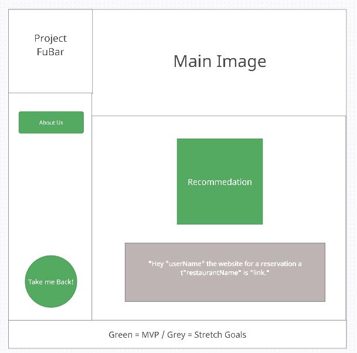

# Final Project

## Seattlight
    - We built this website with the intent to help the user make a decision on what to choose to do for a night out. Utilizing Javascript, the user can choose between a series of picture choices that will help us create a custom recommendation, stored to local storage, that will be displayed by following the recommendations link to the following page, where our Chef Qadree will hand them their custom recommendation himself.

### Authors:
* Jeff Inman
* Qadree Trimble
* Morgan Jackson

Link to project management board 
[Project Board](https://github.com/users/jinman36/projects/1)

### Table of Contents
* [Conflict Plan](notes/Project:-Prep-1.md)
* [Communication Plan](notes/Project:-Prep-1.md)
* [Work Plan](notes/Project:-Prep-1.md)
* [Git Process](notes/Project:-Prep-1.md)
* [Submitting Your Work](notes/Project:-Prep-1.md)

### User Stories
* [User Stories](notes/userStories.md)

### Vision
* [Requirements](requirements.md)

### Wireframes:

### Links 
* [Creatly](http://creately.com/)
* [Stock Pics](https://www.pexels.com/)

### Credits and Collaborations
* Ryan Gallaway (instructor)
* Michael Faulk (TA)